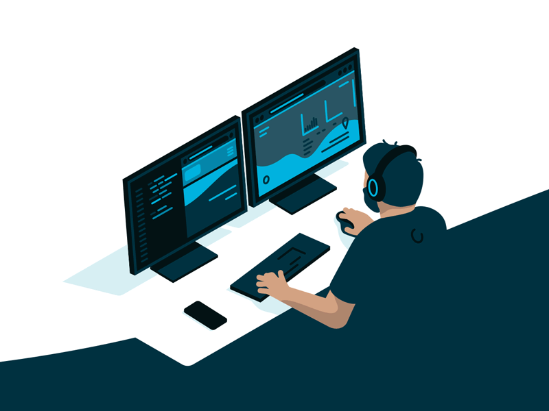

  

## Self-Introduction  

Hi, I am **Shengxiang Lin**, undergraduate student of Qian Xuesen Honor College / Department of Electronics and Information Science, Zhongying College Computer Experimental Class 2201 ( expected graduation in July 2026 ).      
My research interests primarily focus on **Artificial Intelligence**.

## Education
`2026.09 - 2031.06` Ph.D. in Artificial Intelligence, ___Zhejiang University___          
`2024.08 - 2024.12` UCBX Concurrent International, ___University of California, Berkeley___            
`2022.09 - 2026.06` B.S. in Computer Science and Technology (Qian Xuesen Honor Class), ___Xi'an Jiaotong University___          

## Contact     
   
     
Feel free to contact me by email if you are interested in discussing or collaborating with me.            

## Miscellaneous

  

  

 

 

  

