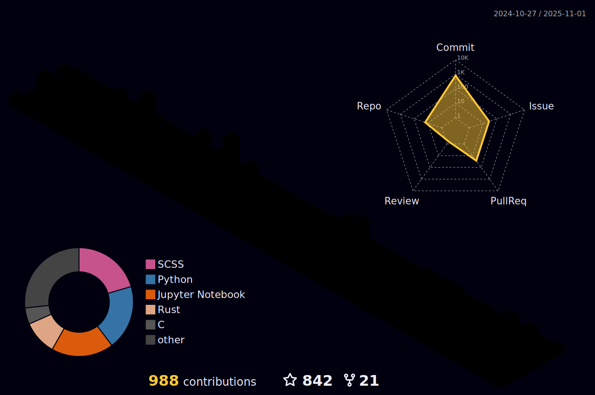

  

<!--访问次数-->

<!--     &emsp;
    &emsp;
    &emsp;
    &emsp;
    &emsp;
    &emsp;
    &emsp; -->

## Self-Introduction

<!--  
- 🌱 Undergraduate in CS2201 (HONOR), of QianXuesen College, Xi'an Jiaotong University (2022.09 - present)
- 🔭 UCBX Concurrent International, University of California, Berkeley  (2024.08 - 2024.12)
- 👯 I’m looking to collaborate on ...
- 🤔 I’m looking for help with ...
- 💬 Ask me about ...
- 📫 How to reach me: ...
- 😄 Pronouns: ...
- ⚡ Fun fact: ...-->
Hi, I am **Shengxiang Lin**, undergraduate student of Qian Xuesen Honor College / Department of Electronics and Information Science, Zhongying College Computer Experimental Class 2201 ( expected graduation in July 2026 ).      
My research interests primarily focus on **Trustworthy AI**, **Privacy-Preserving Computation** and **Financial Intelligence**.

## Education
`2022.09 - 2026.06` B.S. in Computer Science and Technology Experimental Class, ___Xi'an Jiaotong University___          
`2024.08 - 2024.12` UCBX Concurrent International, ___University of California, Berkeley___            
   
    
## Skills      
<!-- 编程语言 -->

   
     
Feel free to contact me by email if you are interested in discussing or collaborating with me.            
   

## Miscellaneous

<!--Line跑码线-->
<!--

<!--
<!--贡献速度-->
<!--

<!--Github奖杯数据展示-->
  

 

<!--使用的语言-搬砖动画-->
<!--
 -->

<!-- -->

<!--

<!-- metrics 基础资料 -->
<!-- 
 
  
-->
<!--
 
-->

 

<!-- 

  

-->

  

